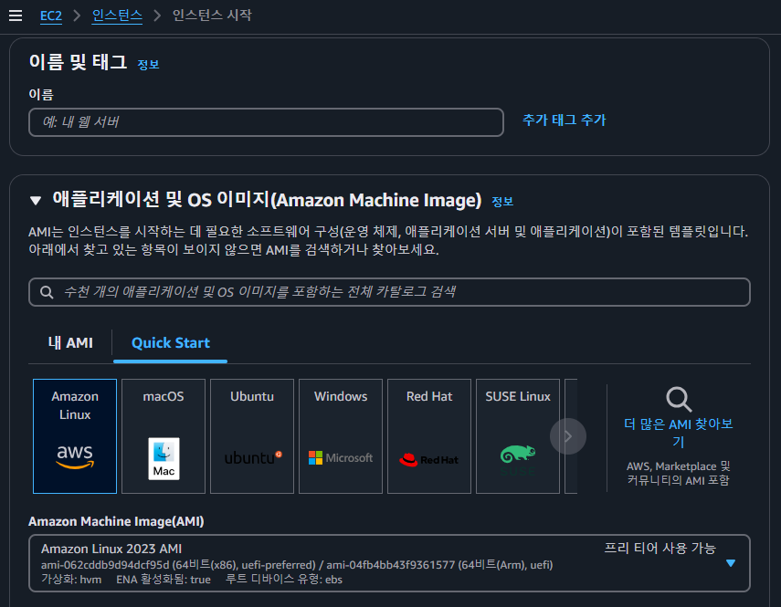

## EC2 🖥️

EC2는 Amazon EC2의 약자로, AWS에서 제공하는 컴퓨팅 자원을 제공하는 플랫폼입니다.

AWS 대표적인 서비스 중 하나로 범용적인 목적을위해 컴퓨팅 자원을 빌릴 수있는 서비스 이며 컴퓨터 가동시간만큼 비용을 지불합니다.

## EC2 시작하기 

- EC2를 시작하기 위해서는 AWS 계정이 필요합니다. 🔨

---

EC2 에서 빠른 시작을 위해 다양한 AMI(amazone machine image) 를 제공하고있습니다. 이러한 이미지들로 실행되는 인스턴스(가상 컴퓨터) 를 통해 클라이언트(사용자) 는 컴퓨팅자원에 접근 및 리소스를 활용할 수 있게합니다.

> 각 AMI 로 생성된 인스턴스 마다 다음과 같이 확인 해야할 사항들이 있습니다. 
> - linux 배포판별 사용하는 관리프로그램 
    - 대표적으로 Amazon 리눅스는 `dnf` 커맨드를 통해 패키지 관리를 하며 이는 `Ubuntu` 의 `apt` 와 유사하나 커맨드가 다를 수 있습니다.
> - 윈도우 서버, 맥 서버의 접근방법
    - 대부분의 linux 배포판의 경우 접근방법이 동일하지만 이와다른 윈도우 , 맥서버의 경우 접근방법이 다를 수 있습니다. 대표적으로 윈도우 서버의 경우 EC2 인스턴스 직접연결시 `22` 포트를 통한 `ssh` 접근이아닌 `3389` 포트를 통한 `rdp` 접근을 사용합니다. 

## EC2 옵션

- 보안그룹
    -> 접근 허용/거부를 위한 보안그룹을 생성   
    -    *`ACL 이후에 적용됨`
- 키 페어
    -> 외부에서 인스턴스로 접근할경우 인증을 위한 키 페어를 사용   

- 네트워크   

    -> 인스턴스가 동작할 vpc 등 네트워크 환경을 구성

### EC2 생성시 확인해야할것

- amazone linux 이미지 사용시 사용자 이름은 `ec2-user` 를 기본값으로 사용된다. 이는 각 리눅스 이미지 정책마다 다르며 대표적으로 `Ubuntu` 이미지의 경우 `ubuntu` 를 기본값으로 사용한다.

### 보안그룹

EC2 메뉴 하위의 보안그룹 설정을 통해 보안그룹을 생성할수있습니다. 

> 인바운드 규칙   
> 인바운드 규칙은 들어오는 트래픽(요청)에대한 제어를 하기위한 규칙입니다. 외부에서 EC2 에 접근 및 리소스 요청에대한 제어를 합니다.

대표적인 설정들로는 

SSH - 외부에서 EC2 에 쉘로 접근을 허용하는경우 22(SSH를 사용하는 알려진포트)  

HTTP -   

HTTPS -   

>아웃바운드 규칙   
> 아웃바운드 규칙은 나가는 트래픽(요청)에대한 제어를 하기위한 규칙입니다. EC2에서 요청이 인터넷을 통해 나가는경우 해당 옵션에 영향을 받습니다.

